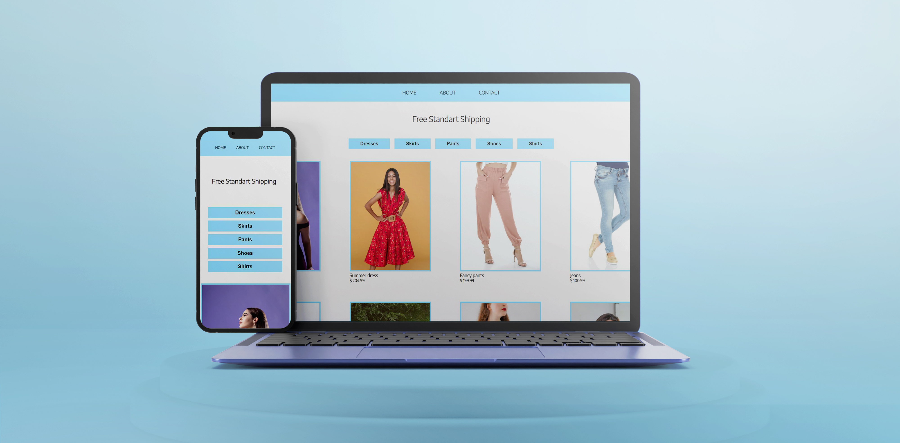

# Filter React app




## 🦉 Main information

Simple app to understand elements filtering in React applications.

## ⏲️ Run project

In the project directory, you can run:

### `npm start`

Runs the app in the development mode.\
Open [http://localhost:3000](http://localhost:3000) to view it in your browser.

The page will reload when you make changes.\
You may also see any lint errors in the console.

## ⚡ Setup

This project was bootstrapped with [Create React App](https://github.com/facebook/create-react-app). 

The following technologies and components were used in this project:

### Create React app

```
npx create-react-app my-app
cd my-app
npm start
```
### Install React Router DOM
```
npm i react-router-dom
```
### Install React Lorem ipsum
```
npm i react-lorem-ipsum
```
